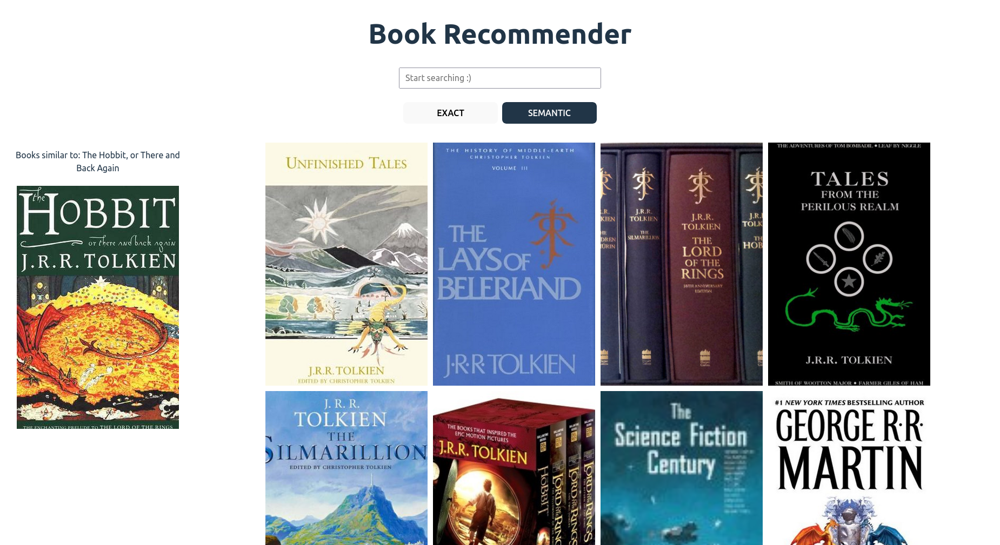

# Book Recommender with Semantic Search
This project leverages model embeddings stored in a PostgreSQL vector database to provide advanced semantic search capabilities. You can search for books by title and discover books similar to the ones you like with just a click. Recommendation is based on descriptions.
<p style="margin-right: 10px;">


</p>

## Usage 

Running model backend:
```
cd backend/model_backend
fastapi dev server.py
```

Running go server:
```
cd backend/server
go run .
```

Running frontend:
```
cd frontend
npm run dev
```

## Used resources:
https://github.com/scostap/goodreads_bbe_dataset/tree/main

